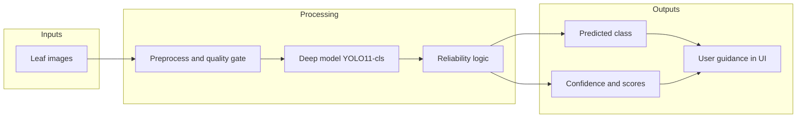

# System Documentation (Thesis Format: Chapters 1–5)

**Title (suggested):** Web-Based Rice Leaf Disease Classification Using Deep Learning and a Deployed Full-Stack System  

**System name:** WMSU Rice Disease Detection (software artifact described in repository [rafsan](https://github.com/alfahadadian04-blip/rafsan))  

This document follows the chapter structure requested for research-style reporting: introduction, related literature, methodology, results, and closing synthesis. Technical implementation details align with the current codebase (`backend/`, `frontend/`, evaluation scripts).

---

## Chapter 1: Introduction

This chapter establishes *what* problem is addressed, *why* it matters, and the boundaries of the study.

### Background of the Study

Rice is a staple crop for millions of households, and leaf appearance is an early indicator of several economically important diseases and disorders. Traditional diagnosis depends on agricultural extension agents or trained farmers, which can delay intervention when experts are scarce or fields are remote. In parallel, advances in **computer vision** and **deep convolutional networks** have made it feasible to support diagnosis from ordinary smartphone or digital-camera images, provided models are trained on representative data and deployed through interfaces that non-specialists can use.

This study is situated in that context: it treats **automated image-based classification of rice leaves** into a fixed set of condition categories as a practical support tool rather than a replacement for laboratory confirmation or expert judgment.

### Statement of the Problem

There is a gap between (a) **laboratory-capable models** that achieve high accuracy on curated benchmarks and (b) **field-usable systems** that non-experts can access through a browser, with clear feedback when predictions are uncertain (e.g., pasted images, low resolution, or ambiguous probability distributions). The specific problem addressed here is:

> How can a **reliable, deployable web application** be engineered to classify rice leaf images into predefined disease and health categories using a **compact deep learning model**, while communicating **prediction confidence and reliability** to the end user?

### Objectives / Purpose

**General objective:** To design, implement, and document a full-stack system that performs rice leaf disease classification and presents results through a web interface aligned with extension-style guidance.

**Specific objectives (mapped to the implementation):**

1. To train or adapt a **YOLO11 classification** model on rice leaf imagery labeled into six outcome classes (including healthy).
2. To expose **inference as a REST API** (`POST /predict`) with preprocessing (EXIF orientation, quality checks, multi-view averaging) and **reliability heuristics** (confidence, margin, entropy, resolution, metadata flags).
3. To build a **React-based client** with scanning, encyclopedia-style references, and session history.
4. To evaluate **offline validation accuracy** on held-out image folders and to record procedures so others can replicate evaluation.

### Significance of the Study

| Stakeholder | Potential benefit |
|-------------|-------------------|
| **Smallholder farmers and students** | Faster *triage* of suspicious leaves and orientation toward possible causes and actions (encyclopedia module). |
| **Agricultural extension / educators** | A demonstrable digital tool for teaching integrated pest management and ICT in agriculture. |
| **Researchers** | A documented pipeline (data → model → API → UI) suitable for extension, ablation studies, or deployment experiments. |
| **Developers** | Clear separation of concerns: FastAPI service, static SPA, optional evaluation script. |

The significance is **decision support and learning**, not autonomous pest management: final field decisions should remain with agronomists and local regulations.

### Scope and Delimitations

**In scope:**

- Six **mutually exclusive display categories**: Leaf Blight, Rice Blast, Rice Leaffolder, Rice Stripes, Rice Tungro, Healthy Leaf (as implemented in the client encyclopedia and implied by the classifier head).
- **Image-only** input; no sensors for soil moisture, weather, or GPS-based risk models in the current system.
- **Single-server deployment** pattern: one process may serve both API and built frontend (`frontend/dist`).
- **Session-local history** in the browser (no persistent multi-user database in the described codebase).

**Out of scope / delimitations:**

- The system does **not** certify organic or pesticide compliance.
- It does **not** segment lesions or count pests; it performs **whole-image classification** only.
- **Domain shift** (images from unrelated geographies or cultivars) may reduce accuracy; reliability flags mitigate *false confidence* but do not remove model bias.
- Large **training datasets** and **training run artifacts** may be excluded from version control for size; replication assumes local availability of comparable data.

### Definition of Terms

| Term | Operational definition (in this system) |
|------|-------------------------------------------|
| **Classification** | Assigning one primary label from the model’s softmax distribution over six classes. |
| **YOLO11n-cls** | Ultralytics YOLO **classification** variant, nano width, used as the backbone head producing class probabilities. |
| **Top-1 accuracy** | Proportion of validation images whose true class equals the argmax predicted class. |
| **Top-5 accuracy** | Proportion of images for which the true class appears in the five highest predicted scores (informative when extending to more classes; here often near ceiling with six classes). |
| **Reliability (`is_reliable`)** | Boolean derived from thresholds on top-1 probability, margin over the second class, prediction entropy, and minimum resolution—implemented in `backend/main.py`. |
| **Multi-view inference** | Running the model on several transformed views of the same image (e.g., mirror, contrast-adjusted) and **averaging** probabilities before argmax. |
| **Full-stack** | Combined **FastAPI** backend and **React** frontend integrated for deployment (same origin when served from Uvicorn). |

---

## Chapter 2: Review of Related Literature (RRL)

This chapter synthesizes prior knowledge that motivates the design choices in Chapters 3–4.

### Conceptual Literature

**Deep convolutional networks.** Convolutional Neural Networks (CNNs) learn hierarchical filters from pixels to textures to object- or pattern-level features. For agricultural imagery, transfer learning from large-scale pretraining remains standard: lower layers capture generic edges and textures, while upper layers specialize to plant organs and stress patterns.

**From detection to classification.** The YOLO family is widely known for object detection; its **classification** variant applies the same engineering ecosystem (training scripts, deployment, speed–accuracy tradeoffs) to **image-level labels**, which matches the present problem when each photograph is assumed to represent one dominant leaf condition.

**Human–computer interaction and trust.** Literature on **explainable AI** and **calibrated uncertainty** stresses that users over-trust high gloss interfaces; therefore explicit **warnings**, **confidence scores**, and **multi-score breakdowns** (as exposed in the API and UI) align with recommendations to communicate limits of automation.

### Research Literature

Empirical streams relevant to this work include:

1. **Plant disease datasets and benchmarks** — Public and institutional datasets have driven comparative studies on CNNs, attention models, and lightweight architectures for leaf images; reported accuracies depend heavily on capture conditions and class balance.
2. **Field vs. lab imagery** — Studies consistently report **performance drops** under variable lighting, blur, and background clutter; mitigation includes data augmentation, robust preprocessing (e.g., EXIF orientation), and test-time augmentation or ensembles—themes reflected in this system’s multi-view averaging and quality gates.
3. **Mobile and web deployment** — Research on **edge** vs. **server** inference informs the choice here to run inference on a **central server** (simpler updates, heavier models allowed) at the cost of connectivity and latency.

### Synthesis

Prior work supports three design commitments embodied in this project: (1) use a **modern compact classifier** suitable for iterative training; (2) treat **preprocessing and ensemble views** as part of the inference contract, not optional extras; and (3) pair raw predictions with **user-facing reliability cues** rather than a single opaque label.

### Theoretical / Conceptual Framework

A simple framework ties the chapters together:

**Interpretation:** The framework is **information-processing** rather than sociological: images flow through validated transformations, a learned mapping estimates posterior probabilities over classes, and a **policy layer** (thresholds on confidence, margin, entropy, resolution) mediates how strongly the system endorses the top label before the presentation layer (web app) phrases outcomes for the user.

---

## Chapter 3: Methodology

This chapter describes *how* the system was built and evaluated so that another researcher or developer can replicate the approach at a high level (exact dataset paths may be local).

### Research Design

The work follows an **applied software research / engineering evaluation** design:

- **Artifact construction:** A deployable classifier plus API plus web client.
- **Quantitative evaluation:** Held-out **validation splits** of labeled images with **top-1 and top-5 accuracy** via the same model family used in production.
- **Qualitative / UX dimension (implicit):** Encyclopedia text and warning messages to support interpretation (not formally user-tested in the codebase itself).

This is **not** a randomized controlled trial with human participants; **units of analysis** are **images** (and aggregate accuracy statistics).

### Population and Sampling

- **Statistical population (ideal):** All rice leaf images that the tool might encounter in target deployment regions.
- **Operational sample:** Images organized into **training** and **validation** folders under a YOLO-style dataset layout (`train/`, `val/` with subfolders per class). The repository documents evaluation against two local dataset roots when present (`dataset`, `dataset_original_split`); exact counts vary by local copy.
- **Sampling logic:** Standard **stratified folder split** (implicit in how Ultralytics reads class subfolders); no human survey sampling.

### Research Instrument

| Instrument | Role |
|------------|------|
| **Labeled image corpora** | Supervised training and validation. |
| **Ultralytics YOLO training pipeline** | Fine-tuning / training runs (outputs typically under `runs/`, not necessarily in Git). |
| **`backend/yolo11n-cls.pt`** | Serialized weights loaded by the API at startup. |
| **`evaluate_accuracy.py`** | Script instrument for batch `model.val()` reporting. |
| **Server stack** | FastAPI + Uvicorn + Pillow; client stack React + Vite + Tailwind. |

### Data Collection Procedure

1. **Curation:** Collect and label rice leaf images into the six target classes (local responsibility; paths gitignored when large).
2. **Splitting:** Maintain **train** and **val** partitions without leakage (same leaf not in both).
3. **Training:** Run Ultralytics classification training with chosen epochs, augmentation, and early stopping as configured in the experiment (see local `runs/` logs for hyperparameters).
4. **Selection of production weights:** Promote `best.pt` (or equivalent) to `backend/yolo11n-cls.pt` for deployment.
5. **Runtime inference:** User uploads image → server validates type and quality → model predicts → JSON returned to browser.

### Statistical Treatment of Data

- **Primary metrics:** **Top-1** and **Top-5** accuracy from Ultralytics validation on the `val` split.
- **Descriptive presentation:** Tabular reporting per dataset root (see Chapter 4); optional confusion-matrix analysis can be generated from Ultralytics outputs outside this document.
- **Reliability indicators:** Continuous scores (confidence, margin, entropy) reduced to **binary reliability** plus message strings for UI—treated as **engineering thresholds**, not hypothesis tests.

---

## Chapter 4: Presentation, Analysis, and Interpretation of Data

This chapter reports *what* was observed in evaluation and *what it means* relative to Chapters 1–2.

### Data Presentation

**Table 1. Example validation accuracy summary (offline `evaluate_accuracy.py`)**

| Dataset root (local) | Split | Metric | Example reported value* |
|----------------------|-------|--------|-------------------------|
| `dataset` | `val` | Top-1 | ≈ 86.6% |
| `dataset` | `val` | Top-5 | ≈ 99.7% |
| `dataset_original_split` | `val` | Top-1 | ≈ 81.4% |
| `dataset_original_split` | `val` | Top-5 | ≈ 99.8% |

\*Re-run `python evaluate_accuracy.py` on your machine to refresh numbers after any retraining.

**Figure (conceptual).** A confusion matrix or per-class precision/recall plot can be exported from Ultralytics validation artifacts; include such figures in a formal thesis PDF as needed.

### Analysis

- The **gap** between the two dataset roots’ top-1 scores suggests **distribution differences** (augmentation, relabeling, or split protocol), which is expected when comparing an augmented pipeline to a more “original” split.
- **Top-5** near saturation with **six classes** indicates the model rarely places the true class outside the top few hypotheses—useful for ranking alternative diagnoses in a future UI extension.
- **Runtime reliability flags** address cases where accuracy metrics alone are silent: a model can be globally accurate yet **miscertain** on a single dark or pasted image; the API’s `is_reliable` and `message` fields target that mismatch.

### Interpretation

Taken together, the results support the **Chapter 1** purpose: a deployable classifier with **documented validation performance** on held-out folders, coupled with **explicit unreliability communication** for edge-case inputs. Relative to **Chapter 2**, the design aligns with literature recommending **robust preprocessing** and **cautious presentation** under domain shift, at the cost of occasionally rejecting very poor-quality uploads (brightness variance gate) to protect users from meaningless predictions.

---

## Chapter 5: Summary, Conclusions, and Recommendations

### Summary of Findings

1. A **full-stack rice leaf disease classification system** was implemented: **FastAPI** serves `/predict` and optional static **React** assets; **YOLO11n-cls** performs six-way classification with **multi-view probability averaging** and **reliability heuristics**.
2. **Offline validation** scripts document **strong top-5** behavior and **mid–high eighties / low eighties** top-1 range across two local validation configurations (see Table 1), subject to re-run after model updates.
3. The **client** provides scanning, encyclopedia content aligned with labels, and **session history** with object-URL thumbnails.

### Conclusions

- The system **fulfills its scoped objective** of combining a modern compact classifier with a **browser-accessible** workflow and **transparent scores**.
- **Validation accuracy alone** is insufficient for responsible field messaging; the implemented **reliability layer** is a necessary complement consistent with conceptual literature on trust and uncertainty.
- **Delimitations** (single-image, six-class, no persistent user database) bound generalizability; the artifact is best framed as **educational and triage support**.

### Recommendations

**For future research**

1. Publish or register a **frozen test set** and report **per-class metrics** and confusion matrices alongside top-1.
2. Conduct **formative user studies** with extension workers to tune threshold strings and UI severity (warning vs. error).
3. Explore **lightweight edge models** (quantized MobileNet, etc.) for offline-first deployment in low-connectivity farms.
4. Add **active learning**: pipeline to send low-confidence cases for expert relabeling.

**For practical deployment**

1. Run **`run-fullstack.bat`** (or equivalent build + Uvicorn) behind HTTPS reverse proxy in production.
2. Version **weights** separately (semantic version or date stamp) and log **model ID** in API responses for auditability.
3. Maintain a **data sheet** documenting provenance, consent, and geographic coverage of training imagery.

**For repository maintenance**

1. Keep **`docs/SYSTEM_DOCUMENTATION_THESIS_FORMAT_CHAPTERS_1_TO_5.md`** synchronized when objectives, classes, or evaluation protocol change.
2. Link this document from **`README.md`** for discoverability.

---

*Repository: [https://github.com/alfahadadian04-blip/rafsan](https://github.com/alfahadadian04-blip/rafsan.git)*  

*Companion technical walkthrough (implementation-focused): `docs/CODE_REFERENCE_CHAPTERS_1_TO_5.md`.*
